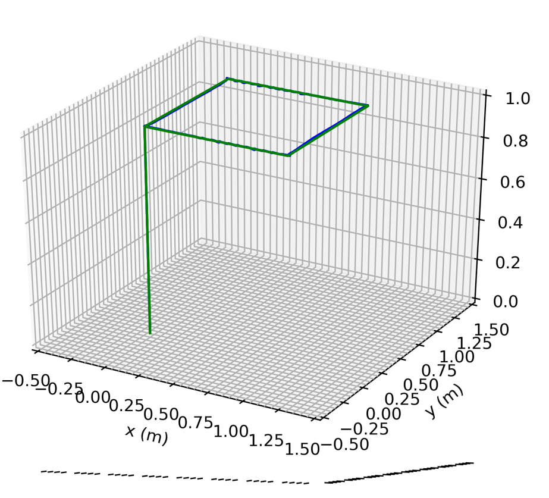

## Sliding Mode Control of UAV

The objective of this project is to develop a robust control scheme to enable a quadrotor to track desired trajectories in the presence of external disturbances. The object/system is a MiniUAV. The simulation of the system is done in ROS Noetic and Gazebo. The UAV starts from (0,0,0) and visits 5 waypoints. The velocity and acceleration at each waypoint is zero. A ideal quintic trajectory is generated and sliding mode control is used to track the trajectory. 

The trajectory tracked is described below. 

p0 = (0, 0, 0) to p1 = (0, 0, 1) in 5 seconds
p1 = (0, 0, 1) to p2 = (1, 0, 1) in 15 seconds
p2 = (1, 0, 1) to p3 = (1, 1, 1) in 15 seconds
p3 = (1, 1, 1) to p4 = (0, 1, 1) in 15 seconds
p4 = (0, 1, 1) to p5 = (0, 0, 1) in 15 seconds

Code is not shared as the code sharing isn't permissible under the Course Regulations!

## Results

The desired trajectory is green and the traced trajectory is blue. The quadrotor follows the
specified trajectory extremely accurately, as seen in the picture above, and the robust control
utilizing boundary layer sliding mode control is successfully achieved. Though, there is not a lot
of fluctuation, we can see some green part of the trajectory. It means it’s a bit off compared with
the desired trajectory. This is because chattering is prevented by using the saturation function.
But even so, we can infer from the observation that the controller closely follows the desired

